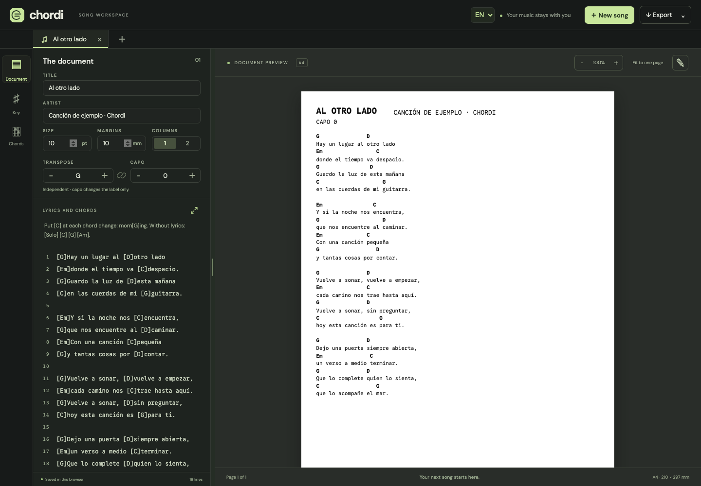
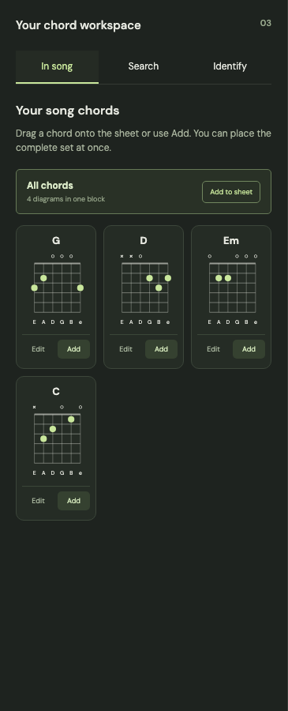

<div align="center">
  
  <h1>chordleaf</h1>
  <p><strong>Your song. Your chords. Everything in place.</strong></p>
  <p>A workspace for writing lyrics and chords, exploring guitar voicings,<br>and making a song sheet for your next rehearsal.</p>
  <p>
    <a href="https://github.com/antoniomml/chordleaf/releases/tag/v1.0.0"></a>
    <a href="https://github.com/antoniomml/chordleaf/actions/workflows/checks.yml"></a>
  </p>
  <p><a href="https://chordleaf.com/">Open Chordleaf</a> · <a href="#a-small-studio-for-your-songs">Features</a> · <a href="https://github.com/antoniomml/chordleaf/wiki">User wiki</a> · <a href="CHANGELOG.md">Changelog</a> · <a href="CONTRIBUTING.md">Contribute</a></p>
</div>



## A small studio for your songs

Preparing a song should leave time to play it. chordleaf brings lyrics, chords and the finished document together: write a verse, place each chord on the right syllable, and check the printed layout as you go.

It is for singers, guitarists and anyone preparing a rehearsal or organizing songs. The interface is available in **English and Spanish**. Use **EN / ES** in the top bar; your songs keep their original language. Project documentation is in English.

| When you want to…             | chordleaf helps you…                                                   |
| ----------------------------- | ---------------------------------------------------------------------- |
| **Prepare a song**            | Start from a blank page, a website URL, or TXT, PDF or Word.           |
| **Time a chord change**       | Anchor a chord to an exact letter without adding spaces to the lyrics. |
| **Write comfortably**         | Resize the editor or open its expanded view.                           |
| **Suit your voice**           | Transpose by semitones and adjust the capo.                            |
| **Find a voicing**            | Browse 828 chords and 3,283 standard-tuning guitar positions.          |
| **Name a shape**              | Place notes on a fretboard and compare harmonic interpretations.       |
| **Try an alternative**        | Insert a voicing or replace one or all occurrences of a song chord.    |
| **Prepare a rehearsal sheet** | Choose font size, margins and one or two columns in an A4 preview.     |
| **Share the result**          | Export PDF, editable Word or text, or print the A4 sheet.              |

## From the first verse to rehearsal

**1. Name your song.** Choose **New song** to start from scratch or import a file. Several songs can stay open in separate tabs.

**2. Write lyrics and add chords.** Put each chord in brackets at the point where the harmony changes:

```text
[G]Keep the light of [D]this new morning
[C]in the strings of my [G]guitar.
```

The printed sheet shows chords above the lyrics, without brackets. For a change inside a word, `mor[G]ning` anchors the chord to the **n**.

**3. Make it comfortable to play.** The **Document**, **Key** and **Chords** sections each occupy the whole sidebar. Adjust the document, inspect the estimated key or work with guitar chords. When ready, choose **Export**. **Export → Print** sends the A4 pages to the browser print dialog without the workspace controls.

[Explore the controls in the user guide →](https://github.com/antoniomml/chordleaf/wiki/User-guide)

## Give every chord a place

The **Chords** section shows the song's chords as a three-column grid of diagrams. Select a card to edit its voicing, or drag a diagram onto the sheet. The search covers major, minor, seventh, diminished, suspended, extended and slash chords.



The interactive fretboard calculates sounding notes and the lowest pitch. Its formula-based identifier compares exact matches, inversions and explicitly labelled omissions. For example, the same notes can suggest C6 or Am7/C. Interpretations depend on context; the tool does not claim to enumerate every possible chord name. See [the harmony model](https://github.com/antoniomml/chordleaf/wiki/Harmony-model).

Choose an interpretation to insert it at the text cursor or replace a specific occurrence or all occurrences of an existing chord. The chosen voicing is saved with the song.

## Your music stays with you

Songs and imported files are processed in your browser. Web imports send the song URL to the Chordleaf server, which downloads the public page; your edited songs are not uploaded. There are no accounts. Changes are saved automatically in that browser.

**Save an editable project for any song you want to revisit.** Choose **Export → Save editable project** to download a `.chordleaf.json` file; open it later through **New song → Open editable project**. PDF and Word are sharing formats and do not mark the project as saved. Closing a song discards its browser copy; Chordleaf warns when the project has not been saved or has later changes. Browser storage is only a temporary recovery copy and does not sync devices. **Workspace backup · JSON** preserves every open song separately.

Document settings include a checkbox for the `chordleaf.com` page footer. It is on for new songs and can be switched off for the preview, PDF and Word export.

Both interface and document fonts are served by the app itself. There are no third-party font requests or analytics scripts. See [privacy and storage](https://github.com/antoniomml/chordleaf/wiki/Privacy-and-storage).

## Install it, print it

Chordleaf is an installable app. Open it in Chromium, Firefox or Safari and choose **Install**, or add it to your home screen on a phone. After the first visit a service worker keeps the editor and the sheet available offline; only web imports need the server. **Export → Print** paints just the A4 sheet, without the workspace chrome.

**Export → ChordPro (.cho)** writes a portable plain-text chord sheet with `{title}`, `{artist}` and `{capo}` directives, understood by apps such as SongBook, OnSong and the ChordPro toolchain, and it can be imported back here.

## A workspace with room to grow

The workspace gives phones separate Document, Edit, Harmony and Preview views. Harmony has one row for key analysis, song chords, chord search and chord identification. The lyrics editor fills the available space, songs remember their last view, and the sheet still supports pinch zoom. Scanned PDFs require external OCR, complex layouts may need corrections after import, and Word rendering depends on the reader and available fonts. Audio transcription is not available yet. See the [changelog](CHANGELOG.md) and [export QA notes](docs/export-qa.es.md).

## Take part

Musical ideas, missing explanations and awkward controls are all useful contributions. [Report an issue](https://github.com/antoniomml/chordleaf/issues/new?template=bug_report.yml) or [suggest a feature](https://github.com/antoniomml/chordleaf/issues/new?template=feature_request.yml), using short invented song examples.

To run your own copy, follow [the development guide](docs/development.md). To put it online, use the [step-by-step Vercel guide](docs/deployment.md). Try the public app at [chordleaf.com](https://chordleaf.com/). Preview deployments still require Vercel authentication.

The [user wiki](https://github.com/antoniomml/chordleaf/wiki) is the home for the illustrated guide, common questions, chord theory and storage guidance. The screenshots it uses and the development, architecture and deployment instructions remain in this repository. Report security issues [privately](SECURITY.md).

---

<div align="center">
  <p><strong>Made to play.</strong></p>
  <p><a href="https://github.com/antoniomml/chordleaf/wiki/User-guide">User guide</a> · <a href="docs/deployment.md">Deploy</a> · <a href="docs/architecture.md">Architecture</a> · <a href="THIRD_PARTY_NOTICES.md">Credits</a></p>
  <sub>Original application code is MIT licensed. See <a href="LICENSE">LICENSE</a>. Third-party data and fonts retain their respective licenses.</sub>
</div>
