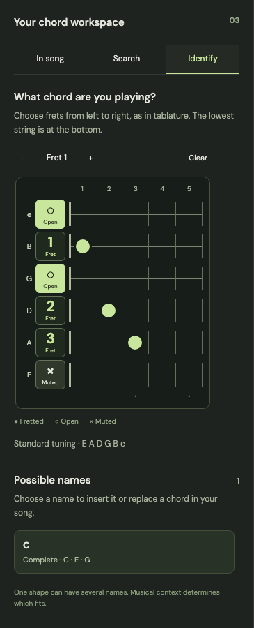

# Your first song in chordleaf

[← Back to chordleaf](../README.md)

Use **EN / ES** in the top bar to choose English or Spanish. The app starts in your browser language (English for languages other than Spanish). This guide uses the English control labels. Changing the interface does not translate songs.

The workspace has a compact navigation rail, an editing sidebar and a sheet preview. **Document**, **Key** and **Chords** switch the entire sidebar. Your text and cursor remain in place when you return to Document.

## Start or import a song

Chordleaf opens without a sample song. Choose the large **New song** action, then **Start from scratch**. The title starts empty; its placeholder is not printed. Add an artist if needed. **Import text or a file** supports:

| File                     | What to expect                                                                                                      |
| ------------------------ | ------------------------------------------------------------------------------------------------------------------- |
| TXT, CHO, ChordPro       | Bracketed chords or chord lines above lyrics. Exported chordleaf TXT retains document settings and custom voicings. |
| PDF with selectable text | Lyrics, chords, headers and columns recovered from their positions. Review the result.                              |
| Word (.docx)             | Text and identifiable column structure. Review titles and alignment.                                                |

Imports accept up to **10 MiB per file**, **50 PDF pages** and **50,000 text characters per song**. Large or complex documents can still take longer to process. Scanned PDFs need external OCR. Convert legacy `.doc` files to `.docx` first. Each song opens in a tab. Closing a song with unexported changes requires confirmation.

## Place a chord precisely

Write its symbol in brackets immediately before the letter where it should sound:

```text
[G]Let it ring, [D]start again.
A mor[Emaj7]ning beside the [Abm7b5]sea.
```

In `mor[Emaj7]ning`, the chord starts at **n**. Brackets take no space on the sheet. If long symbols collide, they stack vertically without moving the lyric anchor. Transposition, font size and columns preserve those anchors. A manual line break gives more control over long verses. Emoji and combining characters may not align like ordinary monospaced text.

## Write comfortably

Drag the vertical divider to resize the editor. Focus it with Tab and use Left/Right; Home or double-click restores its starting width. On mobile, the sidebar and sheet stack vertically.

The expand icon beside **Lyrics and chords** opens a larger editor with the same text, cursor and undo history. **Done** or Escape returns to the document. Changes save while typing.

The preview's pencil enables editing directly on the sheet. Select a verse; Enter commits, Escape cancels and Shift+Enter adds a line break.

## Browse, edit and print chord diagrams

Open **Chords → In song**. Each card shows a chord name and its current guitar diagram. Click the card to edit the frets; the edit hint appears on hover or keyboard focus. Values run from low E to high e: `-1` is muted, `0` open, and positive values are frets. You can mark a custom voicing with an asterisk or restore the catalog shape.

Drag a card onto the sheet, or use its compact **Add** action. **All chords → Add to sheet** places every song chord in one clearly labelled block. Diagrams can be moved, resized or removed. Drag the right edge to change width, the bottom edge to change height, or the corner to change both. Column counts stay fixed while resizing, so making the frame smaller does not unexpectedly enlarge the diagrams. Select the grid button on a diagram group to set width and height in millimeters and choose its columns, with a live preview. Rows follow the number of chords; diagrams keep their proportions inside the frame.

Arrow keys move a focused diagram and Delete removes it. On a resize handle, Left/Right changes width and Up/Down changes height; hold Shift for smaller increments. Diagrams and custom positions are included in exports. Dots and barres stay green in the sidebar and print black on white in the document, PDF and Word.

**Search** searches 828 chords and 3,283 positions. Select a diagram to view alternative positions. Supported aliases include `EM7` / `EΔ7` for `Emaj7`, `A♭ø7` / `Abm7(b5)` for `Abm7b5`, `C6/9` for `C69`, and `Dm(maj7)` for `Dmmaj7`. A recognized symbol may still have no catalog voicing.

Read diagrams from low to high strings, `E A D G B e`: ○ is open, × is muted, dots mark frets. A number at the side marks the starting fret for higher positions.

## Identify a chord on the fretboard



Open **Chords → Identify** and place a dot on each string you want to play. The horizontal fretboard follows tablature orientation: frets increase left to right, the high e string is at the top and low E is at the bottom. Its size stays fixed when the sidebar gets wider; on a wide sidebar, interpretations appear beside it. Press the same dot again to mute it. The control beside each string name switches between **× Muted** (muted) and **○ Open** (open), with contrasting backgrounds and visible labels. **− Fret 1 +** moves the visible five-fret window one fret at a time; selections outside that window remain saved and their fret numbers appear beside the string names. **Clear** mutes all strings.

The panel focuses on the fretboard and possible chord names. Exact interpretations come first, followed by incomplete voicings labelled `no5` (missing fifth).

Names and fret numbers are relative to the capo. A short note indicates the active capo. The identifier covers a documented formula vocabulary, not every possible harmonic analysis. Read [the harmony model and its limits](harmony.md).

Select a result to retain that exact voicing. **Insert at cursor** adds it where you left the text cursor. Alternatively, choose a song chord under **Replace in song**, then choose all occurrences or a specific numbered occurrence with its line number. **Replace chord** updates bracket tokens without changing lyrics. **Undo last change** restores the previous text, shapes and sheet diagrams; subsequent text changes invalidate that undo action. Custom shapes belong to a chord symbol, so every occurrence of that same symbol shares its voicing.

## Adapt the song to your voice

In **Document**, **Transpose** moves all chord symbols by a semitone. Section labels such as `[Estribillo]` remain unchanged.

**Capo** sets the capo fret. The chain links it to the chords: raising a linked capo by one fret lowers the chord symbols by one semitone to keep the sounding key. Enabling the chain alone changes no chords.

**Key** estimates the key from the written chords and shows its degrees. This is guidance, not a definitive analysis, and is not printed.

## Prepare the sheet

Adjust font size, margins and one or two columns. **Fit to one page** attempts to fit the song by reducing font size to a readable minimum; a long song may still need multiple pages. Preview zoom changes only the view, not the exported layout.

Write `{column}` on its own line to start another column, or another page in a single-column document. It is not printed. Instrumental passages can include separators:

```text
[Emaj7] | [G#m7] - [E5+]
```

## Save and share

| Export      | Use it for                                                                     |
| ----------- | ------------------------------------------------------------------------------ |
| PDF         | Printing or sharing a fixed layout.                                            |
| Word · DOCX | Further editing in a word processor; rendering may vary.                       |
| Texto · TXT | Preserving lyrics, anchors, settings and custom diagrams for exact re-editing. |

Preview, PDF and Word share a layout model. Reimported PDF or Word reconstructs that model from appearance, so review chord placements. TXT is the best editing backup. Autosave belongs to this browser: export before changing devices or clearing browser data.

## Import a song and fit the page

**New song** always opens the initial menu: **Import text or a file**, **Import from a website**, then **Start from scratch**. Each import option opens its own screen; **← Back** returns to the menu. Closing and reopening starts fresh. Paste lyrics with aligned chords or open TXT, ChordPro, text-based PDF or DOCX. Legacy `.doc` files must first be saved as `.docx`.

For a web import, paste an HTTPS song URL from Cifra Club, LaCuerda or Ultimate Guitar. Chordleaf converts the accessible chord version into editable lyrics and anchored chords. LaCuerda supports both its normal chord page and its `/TXT/` link. Integrations are maintained per provider rather than per song, so a provider markup change can require an adapter update. Search pages, protected content and tablature-only versions are not supported. The source URL is kept with the working song. A running Chordleaf server is needed for this option.

Every import tries one and two columns, 6–10 mm margins and 8–20 pt type, choosing the largest font that fits on one A4 page. Imported column/page breaks are reflowed. At equal font sizes, one column and 10 mm margins take preference. Longer songs keep all their content on multiple pages rather than shrinking below 8 pt. **Fit to one page** repeats this search; all document controls remain editable afterwards.

The preview, PDF and Word documents include a small grey **Chordleaf** footer. Catalog diagrams use the original fingering's barre information, including full and partial barres; unknown custom shapes infer a conservative barre when possible.

## Instrumental lines (intros and solos)

Write `[Solo] [C] [G] [Am] [F]` on its own line. The sheet displays **[Solo] C – G – Am – F**, all on the same baseline. `[Intro]` works in the same way. A line with only several chords also works, even if written together as `[C][G][Am]`. Explicit bar lines and repeat signs such as `|: [C] | [G] :| x2` are preserved. Long sequences wrap between whole chords. The preview, PDF and Word share this layout.

Bracketed sequences remain independent of the following lyric line. Plain imported chord rows above lyrics still attach to those lyrics; for an explicit standalone passage, use brackets and optionally a section label or bar separators.

## Recover a damaged browser session

If saved data cannot be read, Chordleaf leaves the original browser storage untouched and shows **Recover data**. Download that JSON file and keep it private; it can contain your songs. Export any new work as TXT before leaving. Ask for help using an invented example rather than posting the recovery file publicly. Once you have recovered or backed up everything you need, clear this site's stored data in your browser settings to start a clean session. Recovery JSON is a diagnostic backup, not a supported song-import format.

Chordleaf allows one active editor per browser profile and origin. A second browser tab asks you to close the first before continuing, preventing stale windows from overwriting saved songs. The song tabs inside Chordleaf are safe to use together. An up-to-date HTTPS browser with Web Locks support is required.

## Full workspace backups

Choose **Export → Workspace backup · JSON** to save all open songs, layouts and custom chord shapes. To restore, choose **New song → Import text or file → Open file** and select the JSON backup. Restored songs become new tabs; existing songs are preserved. The versioned format currently supports up to 500 songs, 50,000 characters per song and 10 MiB per import. Future unsupported versions are rejected rather than guessed.

Export a workspace backup before moving between a preview address and your final domain: browser storage does not move between websites. Keep the backup somewhere safe; it contains your song content.

## Cancelling complex imports

Use **Back**, **Close** or **Escape** to cancel an import. Word decoding and automatic fitting run in dedicated workers that are terminated on cancellation. Browser web requests are aborted; the server still applies its own download timeout. Word and PDF imports stop after 15 seconds if parsing has not completed.

Word imports ignore embedded images, allow at most 32 MiB of declared expanded ZIP content and 2 MiB of generated markup. PDF imports accept at most 50,000 text characters, 20,000 text items and 2,000 characters in any one text fragment. These checks protect ordinary use; they are not a complete hostile-document sandbox. For complex files, split the document or import its text instead.
