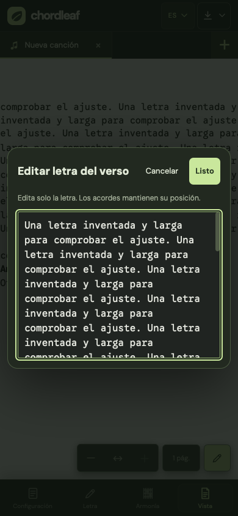
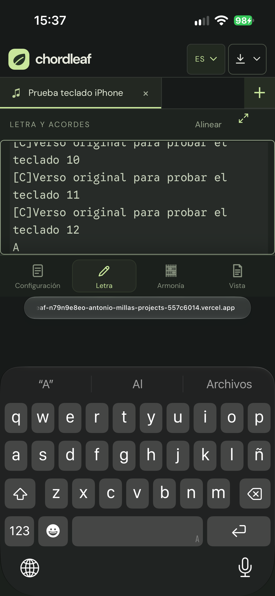
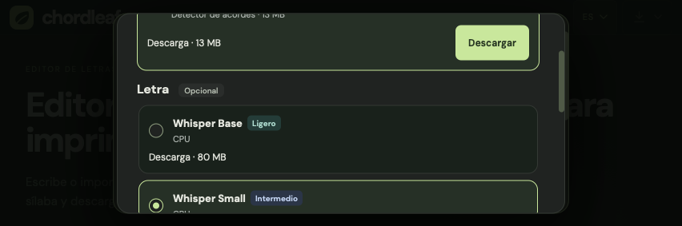

# Physical iPhone audit — 4 October 2026

The browser importer is viable on the tested iPhone 14 Pro with Whisper Base and Small. Keep it experimental: successful execution does not establish transcription or chord accuracy. Whisper Turbo is now unavailable on iPhone/iPad WebKit after Safari reloaded during its download. Qwen remains unavailable on WebKit.

## Device and method

The physical device runs iOS 27.0 and Safari 27.0. Safari's frozen user-agent token says `iPhone OS 18_7`; Device Hub identifies the actual OS. Tests use protected Vercel previews, Safari's remote inspector and Device Hub's real phone screen and software keyboard. Desktop WebKit emulation is reported separately.

Audio tests ran at `3b0da89` and were repeated with Base at `b5da57d`. UI changes progressed through `b5da57d`, `672a359` and `a11860f`. Temporary public reference recordings and an audit helper were served only from protected audit previews, outside Git and production. The release preview contains neither. No private user recording was uploaded.

## Audio results on the physical phone

| Model | Recording                | Duration | Worker time | Outcome                                                               |
| ----- | ------------------------ | -------- | ----------- | --------------------------------------------------------------------- |
| Base  | Spanish WAV              | 25 s     | 8.76 s      | Lyrics and chords                                                     |
| Base  | Spanish M4A/AAC          | 30 s     | 11.88 s     | Lyrics and chords                                                     |
| Base  | English M4A/AAC          | 30.02 s  | 12.81 s     | Lyrics and chords                                                     |
| Base  | Complete Spanish M4A/AAC | 193.34 s | 66.54 s     | 186 word intervals, 59 chord intervals; approximate alignment warning |
| Small | Spanish WAV              | 25 s     | 23.71 s     | Lyrics and chords; approximate alignment warning                      |
| Small | English M4A/AAC          | 30.02 s  | 38.76 s     | Lyrics and chords                                                     |

Base's initial download took 11.11 seconds and Small's 16.33 seconds on this connection. These worker times exclude model downloads and some decoding/UI work; they are single observations, not benchmarks. All inference ran on the phone. The first six recordings were assigned with the browser's `File`/`DataTransfer` API and processed by the ordinary import controls.

A separate native end-to-end test downloaded the owned 25-second WAV fixture to Files, selected it with Safari's actual file picker (`audio/x-wav`, 800,044 bytes), and tapped Analyze on the phone. It completed in 8.91 seconds, closed the dialog and opened a third saved song. A fresh Base download at `b5da57d` took 14.38 seconds; a second assigned WAV analysis took 8.28 seconds.

Cancellation during the complete recording terminated analysis after 3.00 seconds. The serialized saved workspace remained unchanged. Pausing Turbo's download with the on-screen control recorded `cancelled` and restored Continue. Completed verified files are reused on retry; partially downloaded files restart from their beginning.

Turbo's retry reached approximately 50% of its 1.09 GB download before Safari reloaded. The recovered diagnostic marked the attempt `interrupted`; all six existing songs remained saved. No Turbo inference ran on this phone. The implementation blocks mobile WebKit selection and downloads, and falls back to Base for an old Turbo preference, including previously cached weights.

### What the logs establish

The first protected preview failed before inference because `credentials: "omit"` stripped its same-origin authentication cookie. Vercel redirected to SSO, which CSP blocked. Using `same-origin` fixed this preview failure; external weight hosts still receive no credentials. Browser regression tests inspect actual outgoing cookie headers. Deployment protection and CSP stay enabled.

The original public-domain attempt from 3 October cannot be reconstructed. The hosting log query returned 403, and inference runs in a browser worker rather than a hosting function. There was no persistent local diagnostic for that attempt. This preview authentication issue does not establish its cause.

Read-only device crash-log inspection found a WebKit Networking disk-write resource report covering roughly 1.105 GB over 27 minutes, with **Action taken: none**. It does not prove a memory kill or the cause of the reload. An older jetsam report concerned a different process. Raw device logs and identifiers remain ignored and are not included here. Peak phone memory was not measured.

## Interface and keyboard

Portrait without the keyboard exposed a 393 × 695 CSS-pixel visual viewport. With the real software keyboard it exposed 393 × 365 at scale 1. Inputs use at least 16px text; tested fields did not trigger automatic zoom.

| Flow                       | Physical observation and change                                                                                                                                                                                                                                                                                                                                                                                                            |
| -------------------------- | ------------------------------------------------------------------------------------------------------------------------------------------------------------------------------------------------------------------------------------------------------------------------------------------------------------------------------------------------------------------------------------------------------------------------------------------ |
| Title and artist           | Both editable with the software keyboard. Safari's focus pan could clip the header; the workspace now follows the visual viewport origin.                                                                                                                                                                                                                                                                                                  |
| Lyrics                     | Hiding the hint/footer while typing increased the usable textarea from about 59px to about 161px. The clean `a11860f` preview exposed a 161px textarea with its end caret visible (`scrollTop` and maximum scroll both 459px). Native Return and A input succeeded after twelve invented lines. Resizing scrolls the textarea only when its caret is at the end.                                                                           |
| Chord search               | `Am` returned matches with the real keyboard. The panel scrolls internally; its first explanatory paragraph is hidden while typing.                                                                                                                                                                                                                                                                                                        |
| Numeric capo               | The real numeric keyboard edited and saved capo 2. The numeric target now has a minimum 44px height.                                                                                                                                                                                                                                                                                                                                       |
| Direct sheet editing       | Editing the first lyric on the sheet preserved its C/G/Am chord anchors. The real keyboard appeared at scale 1; edited text survived export and navigation. The subsequent mobile polish moves this field into a separate viewport-sized dialog, so sheet zoom and long source lines no longer widen the keyboard input. Done confirms and Cancel restores the original verse; Return adds a line break. See the follow-up evidence below. |
| Web import dialog          | Dialog bounds now follow the visible viewport. The URL field and action remain reachable by scrolling inside the dialog. The action's minimum height is 44px. On the final preview, the URL keyboard left 392px of visible height; the dialog was at y=16, height=360, and its action at y=303.59, height=44.                                                                                                                              |
| Landscape without keyboard | At 852 × 283, the previous 760px breakpoint selected the desktop layout. The new touch/short-screen query retains phone panels/navigation, compact spacing and 59px left/right notch safe areas. A desktop window of the same size retains desktop layout.                                                                                                                                                                                 |

Safari can pan a fixed document while focusing a textarea. An attempted window-scroll reset was removed; the final approach follows `visualViewport.offsetTop` for the workspace and dialogs without forcing window scrolling. Device Hub and the inspector occasionally displayed stale frames/results; refreshing their view was necessary. A blank remote frame observed during an intermediate trial is not conclusive evidence of an application crash.

**Landscape finding and recovery:** with Safari's address/tab bars expanded, the real keyboard reported a visual viewport height of **−9px**. The follow-up provides a warning and dismisses a keyboard with less than 96px usable height without changing the draft. A native swipe over the app header can collapse Safari's bars; a stable `100lvh` root scroll range is needed so collapsing chrome does not shrink that scroll range. No Safari-wide setting was changed.

In the working preview, the bars-hidden keyboard exposed about **101px**. The compact source field sat at y=47 with height=54; its 44px Done control stayed at the top. Actual on-screen Return and A input succeeded, and tapping Done restored the saved source. The new direct-lyric dialog exposed a 45px, 16px-text field with its header controls above the keyboard. A native Cancel initially lost its click when blur moved the dialog: Safari emitted pointer/touch events followed by mousedown and a click on the moved dialog. Retaining field focus during both pointerdown and mousedown fixed the single-tap Cancel; the complete original source was restored. A further native Return/A edit and Done saved the lyric while keeping chord occurrences.

A settings-field focus also exposed `innerHeight=195`, `documentElement.clientHeight=283`, `visualViewport.height=101` and an offset of 182. The compact detection now uses the layout height so this focus pan retains its controls. This last refinement passes a Chromium/WebKit regression reproducing those values and the later clean physical replay below. The earlier working-preview keyboard tests included temporary debug styles/handlers that are now implemented in the tracked source; they should not be described as a clean-release replay.

The clean final audit preview is [1e35dd7](https://chordleaf-rc2qijxc8-antonio-millas-projects-557c6014.vercel.app/es/), with application source identical to `bd1566a`. Its release metadata matches the complete Git commit, and the temporary audit helper answers 404.

After reconnecting the phone, this clean preview was tested without style or event-handler overrides. A native tap opened the long-verse dialog; native Return and A input worked. One Cancel tap restored the complete source exactly. A second edit saved with one Done tap, retaining one occurrence each of C/G/Am; changing the C chord to A retained the rest of the source and survived reload. With the portrait software keyboard, the lyric field used 16px text and measured x=29, width=335, height=215 in a 393×365 visual viewport at scale 1. The native artist field measured x=16, y=234, width=361, height=44, also at scale 1.

The clean landscape replay then reproduced −9px on a native title tap with expanded Safari bars: the application blurred the field, displayed the recovery notice and retained the original title. A native root swipe collapsed the bars; more than one gesture was needed in this run. Native artist focus reproduced innerHeight=195, layout height=283, visual height=101 and offset=182 with compact mode active: Artist sat at y=57, height=44, and Done at y=0, height=44. The source field sat at y=47, height=54; native Return/A input and one Done tap saved it. The direct-verse dialog exposed a 45px field at y=52.66 and 44px Cancel/Done controls at y=4.66 in a 100.98px viewport. One native Cancel tap restored the entire source exactly; a second Return/A edit and Done saved it with C/G/Am occurrences retained. These final tests used the tracked handlers and styles; the only added instrumentation observed viewport/focus events.

The clean final preview also verified positive focus offsets: title 0.66px, artist 74px, capo 91.66px and inline lyrics 23.66px. The body followed each offset, fields stayed visible and scale remained 1. Closing the keyboard restored offset 0. Chord search and the web dialog were rechecked with the final code.

## Export and persistence

With an invented song and capo 2, the real PDF action opened a readable one-page PDF in the same Safari tab. Back restored the editor and its saved edits. Permanent PDF saving through Share/Files was not tested.

Word and editable-project export displayed native Safari download prompts; both were confirmed. The generated project contained the expected title, original text, capo and versioned format. Reimporting that generated JSON through `File`/`DataTransfer` restored the song; a separate native JSON picker selection was not tested. Switching ES to EN preserved the edits and capo.

## Validation and limits

The post-merge public-domain check found an additional landscape model-panel defect: at 852×283, the fixed header/chord/footer sections reduced `.browser-voice-scroll` to 6px. The optional Whisper models could not be selected normally on the physical phone. The 1.5.1 follow-up makes short viewports scroll the complete model dialog, retaining every model choice and the continue control. Chromium/WebKit regressions exercise real selection of Small and visibility of the continue control at both 283px and 393px.

The clean [a7d6ea4 preview](https://chordleaf-8j4gzll57-antonio-millas-projects-557c6014.vercel.app/es/) then passed the physical follow-up with Safari's bars expanded. A native Small tap selected `whisper-small`; the model list measured 585px and the entire dialog scrolled. Native Base selection, a native swipe to the footer and a native continue tap completed a fresh Base/chord download. The native Files picker selected the owned 25-second WAV, and a native analysis tap completed Spanish Base/chord inference in 8.603 seconds (`decoded` 0.075s, `worker-started` 0.089s, lyrics stage 0.951s, chords stage 5.849s). The song opened, reload preserved its complete source exactly, and explicit Spanish remained saved. Application styles and handlers were not overridden. Local `pnpm check` passes; 36/37 local browser suites pass, with only the documented Firefox launch failure preventing the PWA suite from completing locally. Chromium/WebKit compatibility passes; Linux CI remains the release gate for all engines.

`pnpm check` passes 196 unit tests, formatting, production build and metadata checks. All 37 browser suites pass against the built server. The final audit commit `1e35dd7` passed the [Linux checks](https://github.com/antoniomml/chordleaf/actions/runs/37229066517), including Chromium/Firefox/WebKit compatibility, and the [Mac checks](https://github.com/antoniomml/chordleaf/actions/runs/37229066518). The new mobile dialog additionally passes an automated axe audit in Chromium and WebKit. Tests cover the mobile Turbo policy, same-origin/external credentials, negative viewport values, visible viewport offsets, dialog bounds, landscape breakpoints and end-caret recovery. Synthetic keyboard tests supplement the physical checks; they cannot reproduce iOS keyboard behavior.

The local Firefox binary fails before visiting the application with “Could not find profile folder”, including a retry with another temporary directory. This is not a Chordleaf failure or a passing Firefox result; the Linux CI matrix passed Firefox. The local launch failure was not counted as an application pass.

A supplementary real Base/chord test generated an original Spanish spoken fixture locally and encoded the same 9.23-second recording as WAV, AAC/M4A, MP3, FLAC and Vorbis/OGG. All five formats completed in desktop Chromium and WebKit, with 21–22 recognized word intervals, no uploads and approximate-alignment warnings. After the online WAV setup, Chromium completed the remaining four imports with its context offline, exercising the cached app, runtime and actual Whisper weights. These engine tests do not establish physical iPhone codec/offline support, sung-word accuracy or battery behavior. Local metadata is in ignored `owned-codecs-results.json`.

On the clean `8466634` baseline, a final native owned WAV import with Automatic returned 22 lines of repeated English text (15.69s); explicitly selecting Spanish returned four nonempty lines (8.51s), still with substantial word errors. The new preference persists that explicit language, explains Automatic's limitation, and stops longer identical token cycles with a partial/repetition warning. It does not post-edit recognized words or promise accurate singing transcription. On clean `1e35dd7`, the native Files picker selected the same 25-second WAV (`audio/x-wav`, 800,044 bytes); a fresh Base/chord download completed and Spanish analysis finished in 8.342 seconds, opening four nonempty lines. Reload retained the imported source, and reopening audio import retained Spanish. This confirms the final native import flow, not transcription accuracy.

Not certified on this phone: private browsing, low/full storage, offline audio inference, battery/thermal limits, screen readers, 200% zoom, ten-minute recordings, every accepted codec or every iOS version. Whisper Base still made substantial sung-word errors in reviewed recordings. No WER, comparative accuracy benchmark or vocal separation test was performed. The lyric planner improves line/stanza presentation without changing recognized words, timing or the original analysis; it cannot recover incorrectly recognized lyrics.

Detailed local evidence remains in ignored `artifacts/iphone-audit/`. This report describes the pre-release tests. Production's `/release.json` and the published release tag identify the deployed version. The [Spanish walkthrough](mobile-release-walkthrough.es.md) explains how to revisit the changes on a phone.
